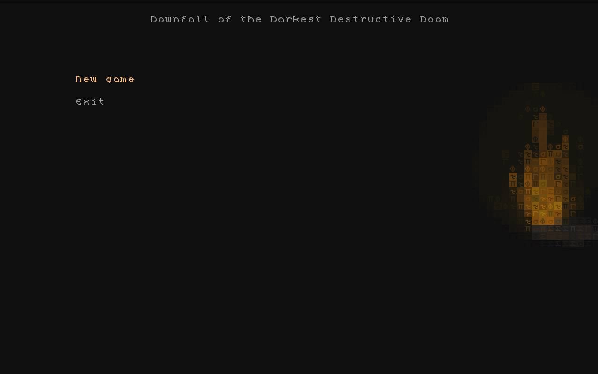
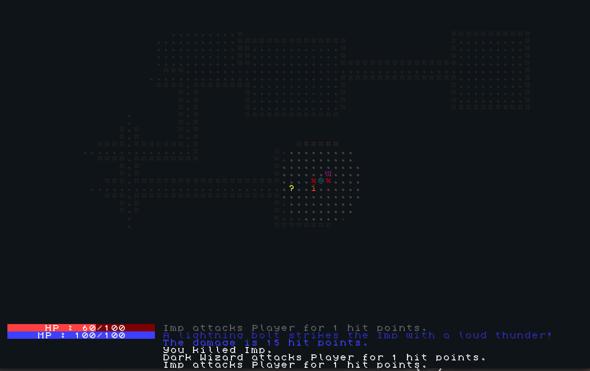

# Downfall of the Darkest Destructive Doom (CPP)
 DDDDCPP is a roguelike written in C++, using libtcod.

## Controls

|         Movement       | Pick up item | Drop item | Inventory |    Fullscreen    | Exit |
|:----------------------:|:------------:|:---------:|:---------:|:----------------:|:----:|
| q, w, e, a, d, z, x, c |       s      |     r     |     i     | Left Alt + Enter | Esc  |

## Fonts

* [Cheepicus 16x16 by Cheepicus](http://dwarffortresswiki.org/Tileset_repository#cheepicus_16x16)

## Helpful resources
Helpful resources used to build this game:

* [Roguelike Tutorial (C++ + libtcod)](http://www.roguebasin.com/index.php?title=Complete_roguelike_tutorial_using_C%2B%2B_and_libtcod_-_part_1:_setting_up)
* [Raycasting algorithm](http://www.roguebasin.com/index.php?title=Raycasting_in_python)
